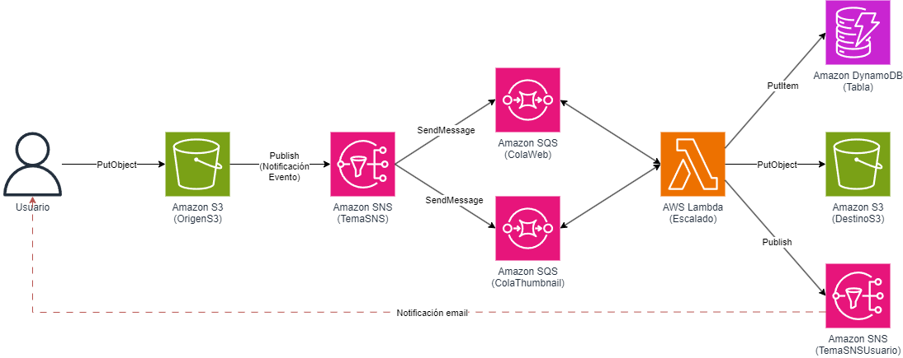

# **Despliegue de una aplicación *Serverless***

## **Objetivo**

El paradigma sin *serverless* ha revolucionado la forma en que se desarrollan, despliegan y escalan las aplicaciones en la nube. AWS (Amazon Web Services) ofrece un ecosistema robusto de servicios serverless que permite a los desarrolladores centrarse en la lógica de su aplicación sin preocuparse por la gestión de la infraestructura subyacente.

El objetivo de este repositorio es desplegar una arquitectura *serverless* que emplea los siguientes servicios:

* Amazon S3
* Amazon SNS
* Amazon SQS
* AWS Lambda
* Amazon DynamoDB

Se implementa un backend de una aplicación que, tras cargar una imagen en formato JPG en un bucket de Amazon S3, realiza un procesamiento paralelo mediante un patrón *fan-out* (empleando un tema de Amazon SNS y dos colas de Amazon SQS) para generar dos imágenes (una en formato 1024x768 y otra en formato 400x300) y posteriormente almacenarlas en otro bucket de Amazon S3. Una vez generadas las imágenes, se envía una notificación al usuario por e-mail, indicando los enlaces temporales de descarga de las imágenes procesadas.

## **Requerimientos**

* Un <em>sandbox</em> de AWS Academy Learner Labs o una cuenta de AWS
* Un entorno Linux con acceso programático configurado a los servicios de AWS

## **Arquitectura propuesta**

* Dos buckets de **Amazon S3**, uno que almacenará las imágenes sin procesar y otro que almacenará las imágenes procesadas
* Dos temas de **Amazon SNS**, uno para enviar la notificación de eventos cada vez que se cargue una imagen en el bucket de Amazon S3, y otro para enviar notificaciones por e-mail a los usuarios
* Dos colas de **Amazon SQS**, para almacenar los trabajos de conversión en cada uno de los dos formatos
* Una función de **AWS Lambda** con la lógica para el reescalado de las imágenes
* Una tabla de **Amazon DynamoDB** que almacenará temporalmente los enlaces a las imágenes procesadas

  

## **Instrucciones (AWS CloudFormation)**

1. Previamente, se establece la región donde se aprovisionará la infraestructura. En los AWS Academy Learner Labs sólo puede ser `us-east-1` o `us-west-2`:

		REGION=us-east-1

2. Si no se dispone de un bucket de S3 para almacenar los artefactos de AWS CloudFormation, hay que crearlo:

		BUCKET=<nombre-bucket>
		
		aws s3 mb s3://$BUCKET --region $REGION

    Si ya se dispone del bucket de S3, se asigna a la variable de entorno:

        BUCKET=<nombre-bucket>

3. Se crea el paquete de despliegue de la función de AWS Lambda

        cd resize

        zip resize.zip resize.py

        cd ..

4. Se empaqueta la plantilla de AWS CloudFormation:

		aws cloudformation package --template-file serverless.yaml --s3-bucket $BUCKET --output-template-file serverless-transformed.yaml --region $REGION

5. Se despliega la infraestructura a partir de la plantilla transformada. El despliegue durará varios minutos:

        EMAIL=*email-notificacion*

	Para desplegar en un <em>sandbox</em> de AWS Academy Learner Labs:

		aws cloudformation deploy --template-file serverless-transformed.yaml --stack-name serverless-stack --region $REGION --parameter-overrides AWSAcademy="SI" email=$EMAIL

	Para desplegar en una cuenta real de AWS:

		aws cloudformation deploy --template-file serverless-transformed.yaml --stack-name serverless-stack --region $REGION --parameter-overrides email=$EMAIL --capabilities CAPABILITY_IAM

6. Una vez desplegada la infraestructura, se recibirá un email en la dirección indicada para aceptar la suscripción a un tema de Amazon SNS, para poder recibir las notificaciones una vez se completen el procesamiento de la imagen.

    Podemos obtener el bucket donde cargar las imágenes con la siguiente orden:

        ORIGEN=$(aws cloudformation describe-stacks --stack-name serverless-stack --region $REGION --query 'Stacks[0].Outputs[?OutputKey==`BucketOrigen`].OutputValue' --output text)       
        
    Para comprobar el correcto funcionamiento, se puede descargar una imagen JPG de gran tamaño y cargarla en el bucket anterior mediante la orden:

        aws s3 cp *imagen-JPG* s3://$ORIGEN --region $REGION

    A los pocos segundos, deberemos recibir dos notificaciones en el correo electrónico configurado